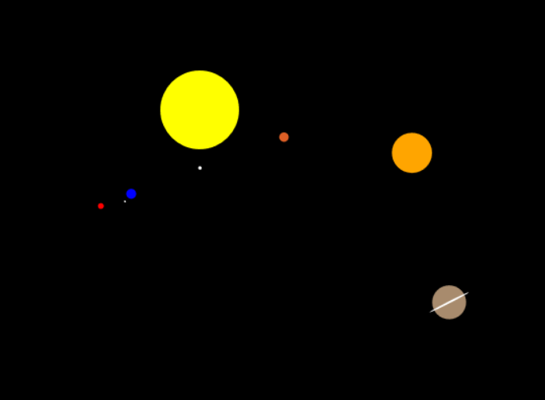

# Simple Solar System

## 2D animated solar system

Orbits are circular, graphics are primitives only, I used the Canvas API and ES6 classes syntax with inheritance.

#### What I would like to do next :
* Elliptic orbits
* Draw orbits
* Display planets name in some way
* Add Kuiper belt
* Prettier colors
* Add music
* But most... use NASA API to draw and update comets or asteroids !

